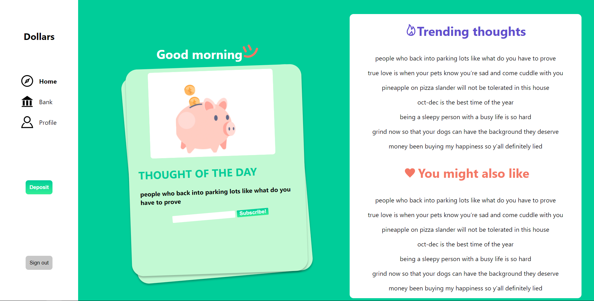
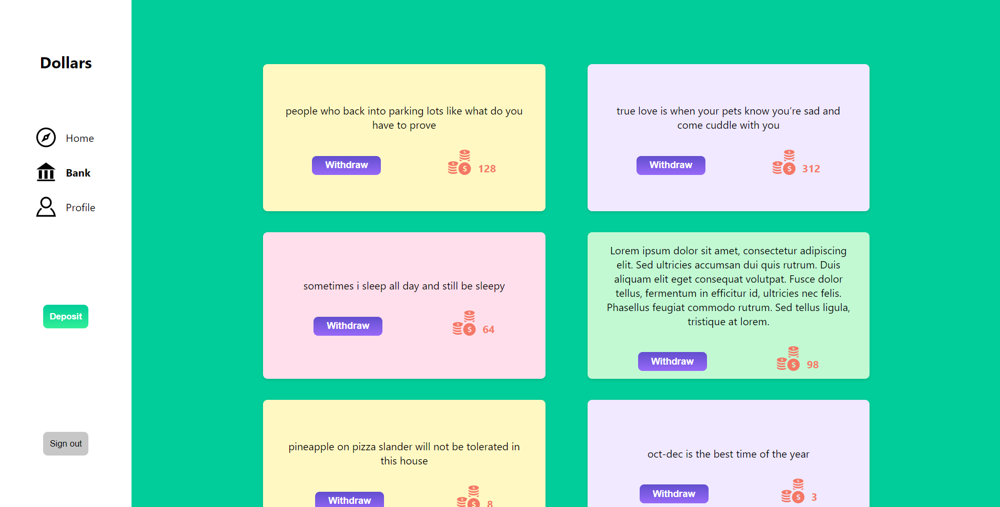
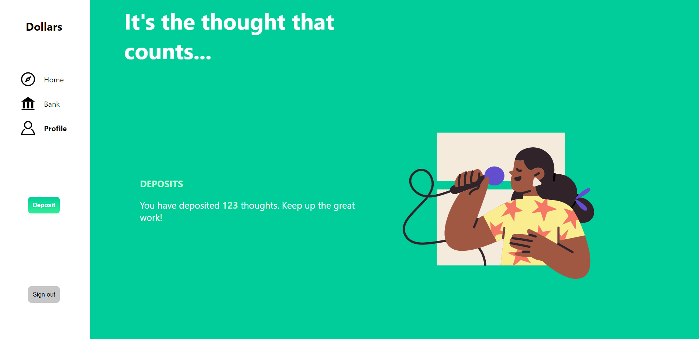
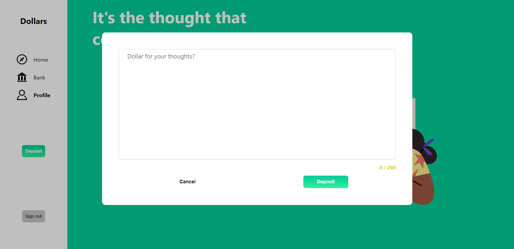
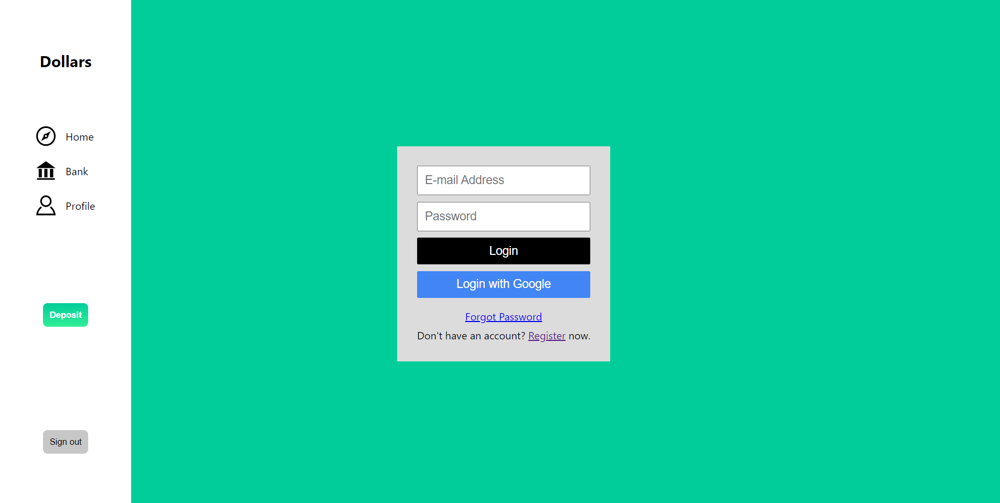
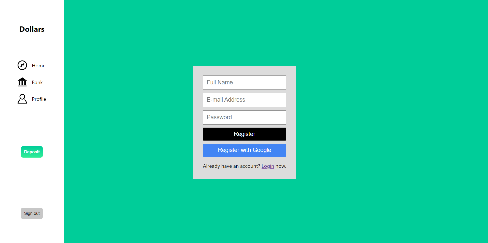

# Backward Hacks 2 Winner: Dollar for thoughts
A social media platform where anonymous users make transactions using thoughts.

### Devpost : https://devpost.com/software/dollar-for-thoughts

 

## DEMO

Home Page

The Thought Bank

Profile 

Add a new thought

Login

Register

## Inspiration

In recent years,social media has shifted from being primarily a connection platform to being mostly a market place. As a result, we were inspired to launch Dollar, a microblogging and social networking platform that aims to go out beyond influencers and companies. Dollar aspires to inspire creativity and interaction in its purest form - thoughts and ideas - through the anonymity and simplicity of the platform. Dollar is a safe refuge where all you are asked for is a "Dollar for your thoughts," as an alternative to the sensationalised and often toxic social media atmosphere.

## What it does

Dollar is a one-of-a-kind social networking platform that allows you to anonymously "deposit" your thoughts while also saving the thoughts of other users. You can't access or read a thought once it's been stored, simulating the transitory nature of thoughts in the actual world.
Users can subscribe to a constant stream of thoughts on the "Bank" page other Dollar users have submitted, which they can either browse past or withdraw. 
Once a user subscribes using their phone number, they recieve the  most trending thoughts daily through text.
Dollar's home page provides users with a unique thought of the day, as well as suggested thoughts based on their previous withdrawals and current platform trends.
Finally, users may view their statistics, such as how many thoughts they have deposited and how many total subscribers they have earned from their thoughts, on their user profile.

## How we built it

React.js was used to create all UI components, bringing Dollar to life. Firebase were used to connect with React and save user data. Express was used for backend along with Twillio to deepen user engagement by adding the functionality of Dollar sending a thought via email or text and daily subscriptions. Finally, Figma was used to design the wireframes of the app and overall user flow!

## Challenges we ran into

Our team's largest issue was integrating Express with our code, especially because many of us were inexperienced with the tool.The biggest challenge our team ran into was integrating Express with our code especially because alot of us were unfamiliar with the tool and working with Twilio API.

## Accomplishments that we're proud of

We're proud of the Dollar concept and the way the user interface and user experience came together. While we did have some challenges, Dollar introduced us to a number of new tools with which we were unfamiliar, like Firebase, and Twillio. We are proud of the idea for Dollar itself and really like how the user interface and user experience came together. Additionally, while we did encounter some obstacles, Dollar introduced us to numerous new tools that we had no prior experience such as Firebase and Twillio.

What's next for Dollar

Moving forward, our team hopes to make Dollar mobile responsive to make it accessible to a greater number of users. Additionally, we want to use an algorithm that utilizes machine learning to more accurately give users thought recommendations based on their interests. Finally, we are hoping to use a tool such as Hootsuite’s social media API to allow users to repost thoughts that they like on their other social media channels.

## Available Scripts

In the project directory, you can run:
### `npm install`
### `node server`
### `npm start`

Runs the app in the development mode.
Open [http://localhost:3000](http://localhost:3000) to view it in the browser.

The page will reload if you make edits.
You will also see any lint errors in the console.
